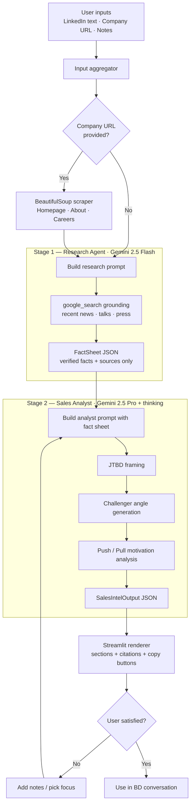

# Methodology — Sales Intelligence Assistant

> A working prototype that turns a LinkedIn profile + a company URL into
> structured commercial intelligence for engaging senior consulting
> professionals (Director / VP / Partner level).

This document explains **why the system is built the way it is**, not just
what it does. The goal is to make every design decision auditable so it can
be challenged, extended, or rebuilt with different trade-offs.

---

## 1. Problem framing

**Who uses it.** Business Development professionals at executive search /
consulting firms who need to engage Director-, VP-, or Partner-level
candidates about career moves or strategic collaborations.

**When.** In the 15-minute prep window before a first conversation, or when
preparing a thoughtful first-touch outreach.

**Why it's hard.**
1. Senior consulting professionals are saturated with generic outreach. The
   bar to earn a reply is high — pitch-shaped messages get filtered out
   instantly.
2. The most useful intelligence is *connective*: how a person's situation
   maps to industry patterns, not just facts about them.
3. Vanilla LLM use produces plausible-sounding-but-unverifiable output, which
   is dangerous when the BD might quote it in a real conversation.

**What the system is optimised for.** Substantively original insight that
the BD could not have written themselves, with every claim traceable to a
source so they can trust it before using it.

---

## 2. Architecture overview

Two LLM stages with deliberately different jobs, separated by a structured
intermediate artefact (the fact sheet). This separation is the spine of
everything else.

**Why two stages.** A single mega-prompt forces one model to do two
incompatible jobs at once: gather evidence and synthesise it. In practice it
gives bad answers to both. Splitting them lets each stage have a tight,
single-purpose instruction.

**Why an intermediate fact sheet.** It is the anti-hallucination spine. The
analyst never sees the web — it reasons only from the fact sheet — so it
*cannot* invent sources. Every claim in the final output points at a fact_id
that the user can audit.

---

## 3. Stage 1 — Research Agent

### Goal
Produce a `FactSheet` — a structured JSON of verified, sourced facts about
the person, the company, the role, and notable signals. **No analysis.**

### Model
**Gemini 2.5 Flash.** Cheap, fast, has native `google_search` grounding,
handles structured output well. The job is information triage, not deep
reasoning, so Flash is the right tier.

### Data sources
| Source | How it gets in | Why it matters |
| --- | --- | --- |
| LinkedIn profile text | Pasted by user | Ground truth for role/tenure |
| Company website | `requests + BeautifulSoup` scrape of homepage, About, Careers | About reveals positioning; Careers reveals what teams are growing → reverse-engineer pain |
| Recent news / press | Gemini native `google_search` grounding (last 6 months focus) | Acquisitions, leadership changes, product launches are the highest-signal triggers |
| Person's public output | Same grounding tool | Articles, podcasts, talks are the "talking points" gold mine |
| Freeform user notes | Pasted by user | Whatever the BD already knows |

### Why a separate scraper *and* google_search
Google Search rarely surfaces a company's own About / Careers content
prominently, but those pages are extraordinarily high-signal. Hitting them
directly with BeautifulSoup costs us nothing and dramatically improves
coverage. Search handles everything *off-domain*.

### Why no LinkedIn scraping
1. Violates LinkedIn ToS in most jurisdictions.
2. Requires authentication / paid third-party enrichment (PDL, Apollo).
3. Production version can swap in a paid enrichment API behind the same
   interface. For a prototype, manual paste is the honest path.

### Output contract
`FactSheet` is a flat structure of `Fact` objects, each carrying a `fact_id`,
a `source_type`, and a `source_detail`. The downstream analyst references
facts by ID. There is also a `coverage_assessment` field where the model is
required to admit what it didn't find — this drives the `data_gaps` in stage
2.

---

## 4. Stage 2 — Sales Analyst

### Goal
Produce the final `SalesIntelOutput` — a structured commercial intelligence
brief that the BD can use directly.

### Model
**Gemini 2.5 Pro with thinking enabled.** This stage does the heavy lifting:
multi-step framework application, generation of language that has to sound
like a human, careful provenance tracking. Pro is justified here even at ~4x
the cost of Flash because the output is what the BD actually reads.

### Why thinking is on
The analyst has to:
1. Parse a fact sheet
2. Apply three sequential frameworks
3. Ground every claim in fact_ids
4. Write outreach copy that doesn't sound like AI

Thinking improves consistency on multi-step reasoning of this shape. The
extra latency (~10-30s) is acceptable for a prep workflow.

### Methodology — why these three frameworks together

The output reflects three layered frameworks, applied in this order:

**Layer 1 — Jobs-To-Be-Done (Clayton Christensen)**
> *"What is this person hired to do, therefore what do they care about?"*

Used for `commercial_priorities`. Forces specificity. A generic "they care
about growth" is rejected; a specific "they're hired to deliver complex PE
ops engagements, so they care about access to deal flow" is accepted.

**Layer 2 — Challenger Sale (Dixon & Adamson)**
> *"What insight reframes how they see their current situation?"*

Used for `conversation_angles`. The Challenger philosophy is that senior
buyers don't want vendors who validate their existing worldview — they want
people who teach them something. Each angle must be a *non-obvious* pattern
specific to this person's actual circumstances, not generic industry truths.

**Layer 3 — Push / Pull motivations (executive search tradition)**
> *"Why might they leave (push)? Why would they join (pull)?"*

Used for `motivation_hypotheses`. This is the search-industry-specific
overlay that pure B2B sales frameworks miss. A candidate's reaction to
outreach depends overwhelmingly on the push/pull balance at that moment.

### Anti-hallucination strategy

Four layers, in increasing strength:

1. **Schema enforcement.** Stage 2 uses `response_schema = SalesIntelOutput`
   with `response_mime_type = "application/json"`. Gemini cannot return prose
   outside the schema.
2. **Evidence-ref requirement.** Every `commercial_priority`,
   `pain_point`, `motivation_factor`, and `conversation_angle` must include
   `evidence_refs: List[str]`. The system prompt forbids empty `evidence_refs`
   on these objects.
3. **Tool isolation.** Stage 2 has *no tools*. It cannot google. So it
   literally cannot invent a source — it can only reference what's in the
   fact sheet.
4. **Data gap surfacing.** When facts are insufficient, the prompt requires
   the model to populate `data_gaps` with concrete suggestions for the user,
   rather than producing low-quality content.

### Confidence labelling
Every claim that *requires* inference (priorities, pain points, motivations)
carries a `confidence: "high" | "medium" | "low"` label. The UI surfaces
this with colour-coded dots so the BD can see at a glance which parts of the
analysis they should treat as testable hypotheses vs. settled facts.

---

## 5. Prompt engineering choices

### Domain-specific tone calibration
The system prompt explicitly bans pitch language ("hope this finds you well",
"circling back", "synergy", "leverage", "touch base", emoji, exclamation
marks). This matters more than it sounds: a Partner-level reader can spot
generic SaaS outreach in two seconds and will not reply.

### Specificity enforcement
The prompt bans vague phrases ("drive growth", "operational efficiency",
"thought leadership") and requires every claim to be tied to the specific
person and company. This is enforced both by instruction and by the
`evidence_refs` requirement.

### Few-shot anchoring
One worked example — a fictional Director at a PE-acquired boutique strategy
firm — is included verbatim in the analyst prompt. It serves three purposes:
1. Anchors the structural depth of analysis expected.
2. Demonstrates the tone (intrigue, not pitch).
3. Shows what an honest `data_gaps` entry looks like.

We use a fictional example deliberately so we never accidentally train tone
on a real identifiable person.

### Audience reframing
The analyst is explicitly told: *"The target audience is NOT a salesperson
selling SaaS. They are inviting a senior professional to consider a career
or partnership opportunity."* This single line shifts the entire output away
from generic B2B sales-speak.

---

## 6. UX design choices

### Staged loading messages
Three messages map directly to the pipeline:
1. "Fetching company signals from the last 6 months..."
2. "Mapping role context and decision authority..."
3. "Drafting conversation angles..."

This is partly UX (perceived progress) and partly demo strategy — it makes
the two-stage architecture legible to a non-technical viewer in real time.

### Sections, not a wall of text
The output is split into ~9 visually distinct sections. The BD doesn't read
this top-to-bottom — they jump to the section relevant to the moment they're
in (outreach time vs. call prep). The structure has to support skimming.

### Citation chips
Every claim displays its `evidence_refs` as inline chips. The full source
list expands at the bottom. This makes the audit path one click away.

### Iterative refinement
Below the output sits a refinement panel with three focus options:
- **Career motivations** — when the BD wants to test for movement readiness
- **Commercial impact** — when the BD wants value-creation framing
- **Objection handling** — when the BD expects pushback

These are not just temperature changes — each focus has a dedicated
regeneration directive that re-shapes the output's emphasis while keeping
the same fact sheet, so the user iterates without paying for stage 1 again.

---

## 7. Cost model

Per-conversation cost estimate (May 2026 Gemini pricing).

| Component | Tokens (est.) | Rate | Cost |
| --- | --- | --- | --- |
| Stage 1 input (Flash) | ~6,000 in | $0.30 / 1M | $0.0018 |
| Stage 1 output (Flash) | ~2,000 out | $2.50 / 1M | $0.0050 |
| Google Search grounding | ~1 prompt | $35 / 1K prompts | $0.0350 |
| Stage 2 input (Pro) | ~5,000 in | $1.25 / 1M | $0.0063 |
| Stage 2 output (Pro) | ~3,000 out | $10.00 / 1M | $0.0300 |
| **Total per analysis** | | | **~$0.078** |

A BD running 20 analyses per day = ~$1.56/day = ~$31/month. A team of 10 =
~$310/month. Eminently affordable.

**Cost optimisations available**:
- Batch API (50% off) for non-urgent overnight bulk pre-research.
- Context caching of the analyst system prompt (90% off the cached portion)
  — worth it once we cross ~50 analyses/day.
- Refinement regenerations skip stage 1 entirely and only re-run stage 2,
  cutting cost ~50%.

---

## 8. Output schema

See `schema.py` for the canonical definition. Top-level fields:

| Field | Type | Notes |
| --- | --- | --- |
| `snapshot` | str | One-sentence orientation |
| `inferred_role_context` | str | Likely scope, authority, KPIs |
| `commercial_priorities` | List[CommercialPriority] | JTBD-framed |
| `likely_pain_points` | List[PainPoint] | Confidence-labelled |
| `motivation_hypotheses` | List[MotivationFactor] | Push/Pull typed |
| `conversation_angles` | List[ConversationAngle] | Challenger-style |
| `talking_points_about_them` | List[TalkingPoint] | Specific, citable, recent |
| `outreach_drafts` | List[OutreachDraft] | InMail + follow-up |
| `exploratory_questions` | List[ExploratoryQuestion] | 3 career + 2 expertise |
| `red_flags` | List[str] | Things to avoid |
| `sources` | List[Source] | Master citation registry |
| `data_gaps` | List[DataGap] | Honest "we don't know" with next-step suggestions |
| `overall_confidence` | str | high / medium / low |

---

## 9. Scope explicitly excluded (prototype)

The following are deliberately *not* in the prototype, with rationale:

| Excluded | Why | When to add |
| --- | --- | --- |
| LinkedIn data via API/scraping | ToS + cost + auth complexity | When workflow validated and a paid enrichment vendor (Apollo / PDL) is approved |
| PDF / JPG ingestion | OCR pipeline adds complexity without changing the core demo | When BDs report frequent need to analyse pasted CVs / screenshots |
| Persistent history | Single-user prototype, no auth | When deployed for a team — pairs with CRM write-back |
| CRM integration | Out of scope for prototype | When the workflow is integrated into HubSpot / Salesforce as a contact-record action |
| Multi-user / auth | Single-user prototype | At deployment — likely behind SSO |
| Caching / context caching | Cost-optimisation, not core | When daily volume crosses ~50 analyses |
| Batch / async pre-research | Premature optimisation | When the team wants overnight "tomorrow's meeting" briefs |

UI stubs exist for the PDF/JPG upload to signal where future ingest goes.

---

## 10. Future extensions (production direction)

1. **CRM write-back.** Analysis result becomes a contact record note in
   HubSpot / Salesforce, including the sources list, so it's auditable later.
2. **Postgres state.** Per-user history with a vector index over past
   analyses, so the BD can ask "have we engaged anyone at MeridianStrat
   before?".
3. **Enrichment API plug-in.** Replace manual LinkedIn paste with an Apollo /
   People Data Labs call behind the same `UserInputs` interface — no changes
   downstream.
4. **PDF/JPG ingestion.** OCR via a managed service (Google Document AI or
   AWS Textract); extracted text feeds into Stage 1 as another source.
5. **Multi-agent expansion.** A third agent for "industry pattern matching"
   that runs in parallel with stage 1 — pulls recent commentary on the
   relevant sub-sector to enrich Challenger angles.
6. **Outcome tracking.** When the BD logs whether a candidate replied,
   feedback loops into prompt tuning for future runs.

---

## 11. Known limitations

- **Output quality depends on input quality.** If the user pastes only a
  LinkedIn headline, the system will (correctly) produce thin output and lots
  of `data_gaps`. This is by design but can frustrate users — onboarding
  should set expectations.
- **Recency drift.** Gemini's search results sometimes return content older
  than 6 months despite the prompt directive. Mitigation: the fact sheet
  forces a `recency` field; the analyst can deprioritise stale facts.
- **Tone drift across regenerations.** Iterative refinement occasionally
  shifts tone toward more generic territory. The few-shot example helps but
  doesn't fully eliminate this.
- **Single-locale assumption.** Prompts and examples currently assume
  English-language professional context. Multi-locale would require parallel
  prompt sets per locale (not just translation).
- **No human-in-the-loop validation step.** The system is honest about
  confidence but a BD using it without judgement could still cite a
  low-confidence inference as fact. The UI surfaces confidence prominently
  but cannot enforce reading it.

---

## 12. How to evaluate this prototype

Three success criteria for an internal evaluation:

1. **Specificity test.** Pick a real Director-level profile. Does the output
   contain at least three facts you didn't already know, *with sources you
   can verify*?
2. **Originality test.** Read the conversation angles. Could a competent BD
   have written these from the public information alone, or do they
   *combine* signals in a way that surprises you?
3. **Honesty test.** Run it on a low-information profile (say, only a LinkedIn
   headline). Does it admit data gaps, or does it confabulate?

If all three pass on three different test profiles, the system is ready for
internal pilot use.

---

## 13. Worked examples

Three live runs of the system, each chosen to probe a different failure
mode. All three were independently audited: claims were cross-checked
against the user's pasted inputs, the company website scrapes, and external
web sources cited by the analyst.

### Example 1 — Benedict Whalley, Senior Partner at Consulting Point

**Input**: LinkedIn About + Experience, plus the firm's homepage. No
freeform notes. Information density: moderate.

**What the system did well**
- Correctly identified that Consulting Point operates two offices (London
  and Leicester) by scraping the company footer — a fact not present in the
  LinkedIn text.
- Generated a sharp Challenger angle: *"UK-based professional-services firms
  talk globally but career paths and power structures remain tied to the
  domestic UK market."*
- Surfaced specific red flags (e.g., "Senior Partner does not necessarily
  imply meaningful equity in a founder-led firm") that demonstrate genuine
  BD savvy.

**What the system over-claimed**
- The output repeatedly stated that Benedict *heads* the Leicester office.
  Audit: the company website confirms Leicester exists, but does *not*
  explicitly assign Benedict to it. The LinkedIn text places him in
  "London Area." The system bridged two facts (Leicester exists + Benedict
  is senior) into a stronger claim than the evidence supported.

**Lesson**
Over-confident inferential bridging is the principal residual risk. The
mitigation lives in the citation system: an auditor checking the bridged
claim's `evidence_refs` against the actual sources catches the
over-reach in under a minute. The system's design enables the audit; it
does not eliminate the need for it.

### Example 2 — Rodrigo Slelatt, Partner at McKinsey & Company

**Input**: LinkedIn About + Experience, plus a rich biographical block in
the freeform notes including five published HBR/McKinsey articles. Information
density: high.

**What the system did well — and verified externally**

This is the case where the system's *recency capability* showed up
clearly. The analyst surfaced two factual claims that no LinkedIn-based
enrichment tool would catch:

1. **"Project Acorn"** — McKinsey's reform of partner profit distribution
   toward equity allocation. **Externally verified**: reported by
   GuruFocus and other outlets within the last week of running this
   analysis.
2. **Bob Sternfels' "migrating pretty quickly away from pure advisory work"
   quote** — from the January 2026 HBR Ideacast. **Externally verified**:
   Fortune and Yahoo Finance both ran the quote in mid-January 2026.

The analyst then connected these firm-level signals to Rodrigo's *personal*
career stake (9-year M&A advisory tenure, 50+ deals, published thought
leadership in pure advisory work) — producing a Push factor that would
land with the candidate because it is structurally true, not generic.

**What this case demonstrates**
The two-stage architecture's value is most visible when recency matters.
Stage 1's Google Search grounding pulled the four-month-old quote; Stage 2's
analyst connected it to the candidate's individual position. Neither
half alone would produce a usable output.

### Example 3 — Adam Sun, Sales Consultant at Paul Smith

**Input**: LinkedIn About + Experience (including a prior role as Founding
AI Engineer at an AI lab) plus the Paul Smith website. No freeform notes
about motivation. Information density: high on professional facts, zero
on private motivation.

**What the system did well — and verified externally**

The analyst surfaced *Paul Smith's appointment of Zia Zareem-Slade as
managing director, with a remit explicitly including digital
transformation*. **Externally verified**: this appointment was
announced **five days before** the analysis was run, by 10+ outlets
including WWD, Retail Gazette, FashionUnited, FashionNetwork, and
TheIndustry.fashion. The system also surfaced Paul Smith's 7%
year-on-year gross profit decline to £97M for FY ending 30 June 2025
(verified via TheIndustry.fashion).

It then assembled a four-step inference: (1) new MD with digital remit, (2)
firm in financial transition, (3) candidate has rare AI + retail
combination, (4) Challenger angle: *"Paul Smith's new MD needs someone
exactly like Adam, but likely doesn't know he exists."*

**What this case demonstrates — the confidence calibration finding**

Because the candidate in this case was a real person willing to validate
the output, the analysis surfaced something more interesting than
"correct/incorrect": **the relationship between the system's confidence
labels and ground-truth accuracy**.

- **High-confidence Pull factor** — *"Desire for a role synthesizing AI
  engineering with commercial / operational acumen"* — **validated by the
  candidate as exactly correct.**
- **Medium-confidence Push factor** — *"Frustration with being siloed on
  the shop floor while leadership attempts top-down digital
  transformation"* — **the candidate reports this does not match his
  experience.** The system flagged this as `medium` rather than `high` —
  the confidence label functioned as designed, warning the user not to
  treat this as fact.
- **Data Gap** — *"Motivation behind his career change from AI Engineer to
  Sales Consultant"* — the actual answer (UK visa sponsorship constraints
  plus a personal interest in the fashion industry plus an internal-mobility
  strategy to reach tech roles inside Paul Smith) is impossible to infer
  from public data. The system correctly populated `data_gaps` with a
  suggestion to ask this in the first call, rather than fabricating an
  answer.

This pattern — high-confidence claims tend to be correct, medium-confidence
claims sometimes wrong, genuinely private information surfaced as data
gaps — is the most important behavioural property of the system. It is
what makes the output safe for a BD to act on.

**Iterative refinement with private context** — the climax of this case.

After the first analysis, the candidate disclosed his real motivation
privately: a UK visa sponsorship constraint forcing exit from the prior
startup, plus a genuine personal interest in the fashion industry, plus
an internal-mobility strategy to reach technical roles inside Paul Smith.
This was pasted into the "Refine the analysis" panel and the system
re-ran the analyst stage on the same FactSheet plus the new context.

What changed in the second pass is the substance of what makes this
system different from a paraphrase tool:

| Dimension | v1 (no private context) | v2 (with private context) |
| --- | --- | --- |
| Overall confidence | high | **medium** — the system became *more* cautious with more information, recognising hidden variables |
| Challenger angle | "Paul Smith's new MD needs someone like Adam but doesn't know he exists" — positions candidate as untapped asset | **"Transformation Paradox: legacy brands in financial distress under new-MD-led transformation almost always prioritise cost-cutting over creating new internal technical career paths. The window for an internal move from sales to AI is closing, not opening."** — *challenges the candidate's stated strategy* |
| Pain point #2 | "Career progression ambiguity in an unstable company" | "Uncertainty due to corporate instability — the environment typically leads to cost-cutting and hiring freezes, **reducing the chance of an internal transfer into a new technical role**" |
| New Red Flag | — | **"Do not assume he wants to leave the fashion industry. The evidence suggests he deliberately moved into it."** |
| Visa context handling | n/a | Kept entirely out of outreach drafts. Surfaced only as a `data_gap` flagged for the recruiting team's screening — not broadcast. |

The shift in the Challenger angle is the key behaviour: the system did
not paraphrase the candidate's strategy back at him. It applied a
contrarian industry pattern to *challenge* the strategy, producing the
exact kind of insight that a Challenger-trained BD would use to provoke
a substantive conversation. The candidate could be told, in a first
call: *"I noticed you may be playing for an internal transfer — but
historically these transformation windows close rather than open. Have
you considered external paths that match your dual skillset more
directly?"*

This is the demonstrated value of the system. It is not a research tool
that gathers facts. It is a strategic analyst that combines public
facts, private context, and industry patterns into an actionable point
of view — while retaining honest confidence calibration and respecting
the sensitivity of private information.

### Cross-cutting lessons

| Property | Example showing it | Implication |
| --- | --- | --- |
| Citation enables audit | Benedict (Leicester over-claim) | A trained BD can verify in under 60 seconds |
| Recency-driven insight | Rodrigo (Project Acorn, Sternfels quote) | Beats CRM enrichment tools whose data is weeks-stale |
| 4-day-old news integration | Adam (Zia Zareem-Slade MD appointment) | The system is current to within days, not months |
| Confidence labels are calibrated | Adam (high→right, medium→wrong) | Labels carry real information; users can rely on them |
| Honest data gaps | Adam (visa motivation) | Private info is admitted, not fabricated |

The single most important meta-property: **the system knows when it does
not know**. Every other property would be undermined without this one.